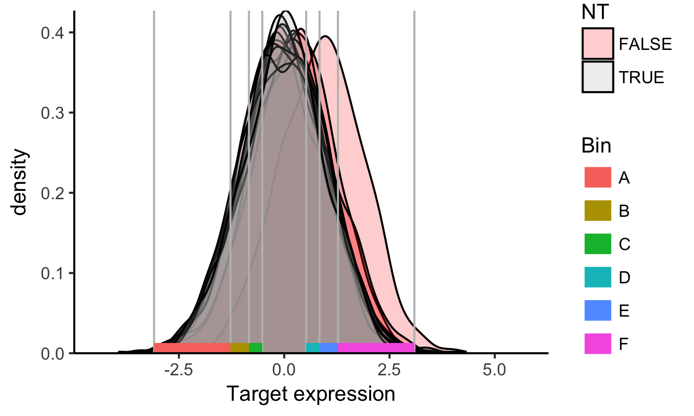
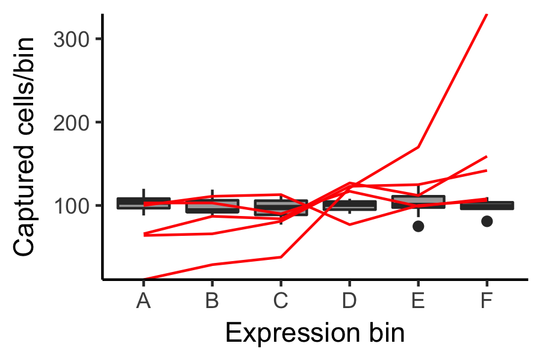
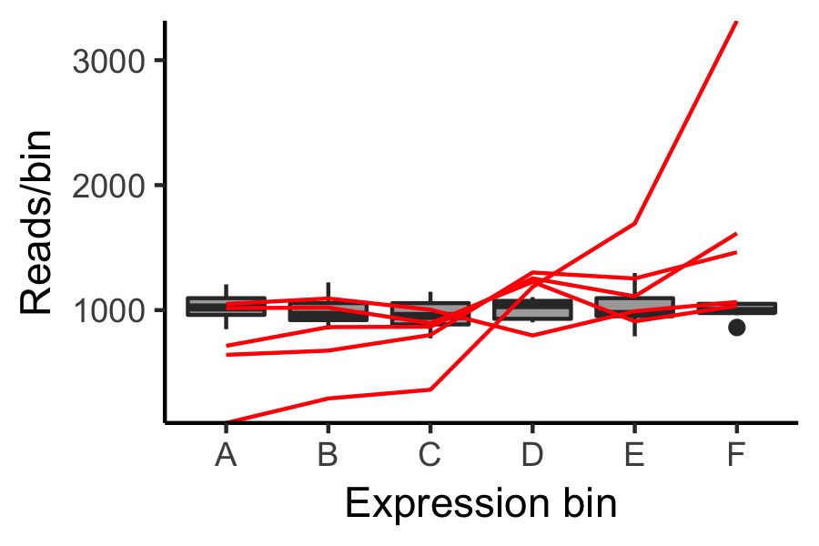
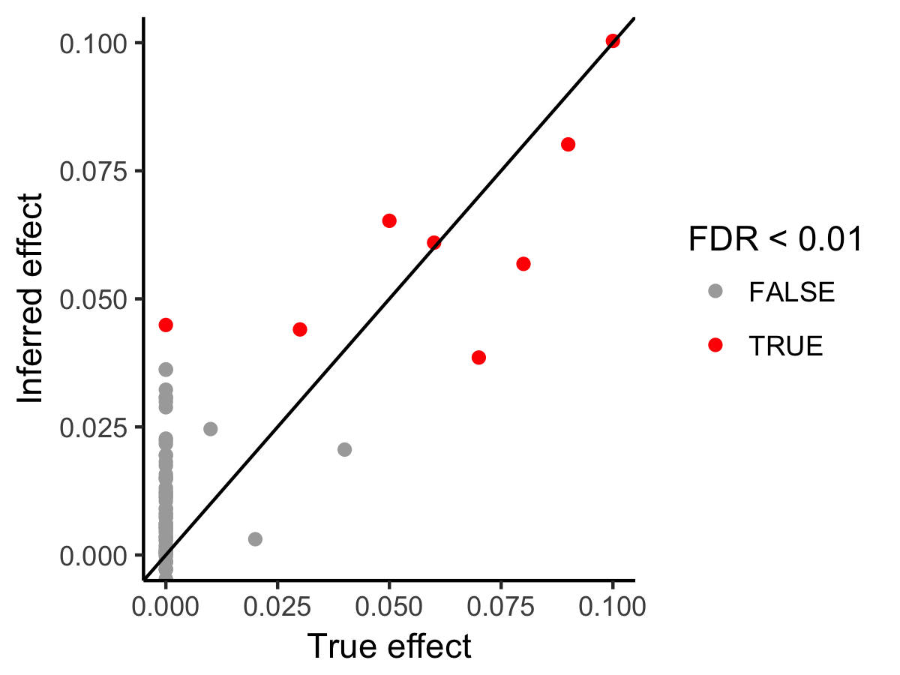

# A tutorial with simulated data

The following is an example that relies on simulated data and makes use of the `ggplot2` and `reshape` R packages.  Since there is no data to load for this example, it should be relatively easy to run and to inspect the variables to better understand the desired formats.  This should also help make clear the underlying assumptions of the model since the data are generated with many of these same assumptions.

## Create the simulated experimental data
Load the required packages and set the seed.  You only need to set the seed if you want your analysis to get exactly the same results as what is shown here.  Otherwise, you can skip this step (and note that if you run things in a different order, the results may differ).
```R
library(ggplot2)
library(reshape)
library(MAUDE)

set.seed(76484377)
```

Set up the simulation.  Here, we're using 5 guides per element, and 200 elements, 100 of which have no effect on expression.  The half that affect expression have effect sizes ranging from 0.01 to 1 standard deviations.  We also include 1000 non-targeting guides.
```R
#ground truth
groundTruth = data.frame(element = 1:200, meanEffect = c((1:100)/100,rep(0,100))) #targeting 200 elements, half of which do nothing

#guide - element map; 5 guides per element; gid is the guide ID
guideMap = data.frame(element = rep(groundTruth$element, 5), gid = 1:(5*nrow(groundTruth)), NT=F, mean=rep(groundTruth$meanEffect, 5))
guideMap = rbind(guideMap, data.frame(element = NA, gid = (1:1000)+nrow(guideMap), NT=T, mean=0)); # 1000 non-targeting guides

guideMap$abundance = rpois(n=nrow(guideMap), lambda=1000); #guide abundance drawing from a poisson distribution with mean=1000
guideMap$cells = rpois(n=nrow(guideMap), lambda=guideMap$abundance); #cell count drawing from a poisson distribution with mean the abundance from above

#create observarions for different guides, with expression drawn from normal(mean=mean, sd=1)
cellObservations = data.frame(gid = rep(guideMap$gid, guideMap$cells))
cellObservations = merge(cellObservations, guideMap, by="gid")
cellObservations$expression = rnorm(n=nrow(cellObservations), mean=cellObservations$mean);

#create the bin model for this experiment - this represents 6 bins, each of which are 10%, where A+B+C catch the bottom ~30% and D+E+F catch the top 30%; in an actual experiment, the true captured fractions should be used here. 
binBounds = makeBinModel(data.frame(Bin=c("A","B","C","D","E","F"), fraction=rep(0.1,6)))
if(F){ 
  # in reality, we shouldn't assume this distribution is exactly normal - we can re-assign expression bin bounds based on quantiles 
  # of the actual simulated expression distribution.  If you run the next two lines, the answer will improve slightly, but the 
  # resulting graphs will look slightly different than those below.
  binBounds$binStartZ = quantile(cellObservations$expression, probs = binBounds$binStartQ);# correct for the actual distribution
  binBounds$binEndZ = quantile(cellObservations$expression, probs = binBounds$binEndQ);
}

# select some examples to inspect for both
exampleNT = sample(guideMap$gid[guideMap$NT],10);# non-targeting
exampleT = sample(guideMap$gid[!guideMap$NT],5);# and targeting guides

#plot the select examples and show the bin structure
p = ggplot(cellObservations[cellObservations$gid %in% c(exampleT, exampleNT),], aes(x=expression, group=gid, fill=NT))+geom_density(alpha=0.2) + geom_vline(xintercept = sort(unique(c(binBounds$binStartZ,binBounds$binEndZ))),colour="gray") + theme_classic() + scale_fill_manual(values=c("red","darkgray")) + xlab("Target expression") + scale_x_continuous(expand=c(0,0)) + scale_y_continuous(expand=c(0,0)) + coord_cartesian(xlim=c(min(cellObservations$expression), max(cellObservations$expression)))+ geom_segment(data=binBounds, aes(x=binStartZ, xend=binEndZ, colour=Bin, y=0, yend=0), size=5, inherit.aes = F); print(p)
```



Now that we've set up our experimental system, we simulate actually capturing cells in the bins
```R
#for each bin, find which cells landed within the bin bounds
for(i in 1:nrow(binBounds)){
  cellObservations[[as.character(binBounds$Bin[i])]]=cellObservations$expression > binBounds$binStartZ[i] & cellObservations$expression < binBounds$binEndZ[i];
}

#count the number of cells that ended up in each bin for each guide
binLevelData = cast(melt(cellObservations[c("gid","element","NT",as.character(binBounds$Bin))], id.vars=c("gid","element","NT")), gid + element + NT + variable ~ ., fun.aggregate = sum)
names(binLevelData)[(ncol(binLevelData)-1):ncol(binLevelData)]=c("Bin","cells");

#plot the cells/bin for each of our example guides
p = ggplot(binLevelData[binLevelData$gid %in% exampleNT,], aes(x=Bin, group=Bin, y=cells)) +geom_boxplot(fill="darkgray")+geom_line(data=binLevelData[binLevelData$gid %in% exampleT,], aes(group=gid), colour="red")+  theme_classic()  + xlab("Expression bin") + ylab("Captured cells/bin")  + scale_y_continuous(expand=c(0,0)); print(p)
```


Now, we simulate sequencing the guides that end up in each bin, assuming we sequence 10 reads per sorted cell
```R
#get the total number of cells sorted into each of the bins
totalCellsPerBin = cast(binLevelData,Bin ~ ., value="cells", fun.aggregate = sum)
names(totalCellsPerBin)[ncol(totalCellsPerBin)]="totalCells";

#add bin totals to binLevelData
binLevelData = merge(binLevelData, totalCellsPerBin, by="Bin")

#generate reads for each guide per bin, following a negative binomial distribution
#n=number of observations; size= total reads per bin; prob= probability of not getting a read at each drawing
binLevelData$reads = rnbinom(n=nrow(binLevelData), size=binLevelData$totalCells*10, prob=1- binLevelData$cells/binLevelData$totalCells)

#plot the distribution of reads for each example guide
p = ggplot(binLevelData[binLevelData$gid %in% exampleNT,], aes(x=Bin, group=Bin, y=reads)) +geom_boxplot(fill="darkgray")+geom_line(data=binLevelData[binLevelData$gid %in% exampleT,], aes(group=gid), colour="red")+  theme_classic()  + xlab("Expression bin") + ylab("Reads/bin")  + scale_y_continuous(expand=c(0,0)); print(p)
```



```R
binReadMat = cast(binLevelData, element+gid+NT ~ Bin, value="reads")

#pretend we sequence the unsorted cells to similar coverage as above:
guideMap$NS = rnbinom(n=nrow(guideMap), size=sum(guideMap$cells)*10, prob=1- guideMap$abundance/sum(guideMap$cells))
binReadMat = merge(binReadMat, guideMap[c("gid","NS")], by="gid")

binReadMat$screen="test"; # here, we're only doing the one screen - this simulation
binBounds$screen="test";
```

## Run MAUDE

Up until now, we have just been building up the data in a way that simulated an actual experiment. With the exception of defining the bin model(s), most of the above is not required (nor even possible, since we're inspecting hidden variables above) for an actual experiment. Only the next two commands would actually be run for a real experiment.
```R
# get guide-level stats 
guideLevelStats = findGuideHitsAllScreens(unique(binReadMat["screen"]), binReadMat, binBounds)

#get element level stats
elementLevelStats = getElementwiseStats(unique(guideLevelStats["screen"]),guideLevelStats, elementIDs="element",tails="upper")
```

Plot the actual effect sizes (those we defined at the begining) compared with those predicted by MAUDE:
```R
elementLevelStats = merge(elementLevelStats, groundTruth, by="element")

p = ggplot(elementLevelStats, aes(x=meanEffect, y=meanZ, colour=FDR<0.01)) + geom_point()+geom_abline(intercept = 0, slope=1) + theme_classic() + scale_colour_manual(values=c("darkgray","red")) + xlab("True effect") + ylab("Inferred effect"); print(p)
```

We can see that the two are highly correlated.  At more extreme effect sizes, MAUDE underestimates the effect size because of the uniform prior applied (in the form of a pseudocount).  However, biological data can be very noisy and so we highly recommend this prior.


Zoom in on the bottom left:
```R
p = ggplot(elementLevelStats, aes(x=meanEffect, y=meanZ, colour=FDR<0.01)) + geom_point()+geom_abline(intercept = 0, slope=1) + theme_classic() + scale_colour_manual(values=c("darkgray","red")) + coord_cartesian(xlim = c(0,0.1),ylim = c(0,0.1)) + xlab("True effect") + ylab("Inferred effect"); print(p)
```

In this particular simulation we have 1 false positive out of nearly 100 true positives (consistent with our FDR cutoff of 0.01), and three false negatives with very small effect sizes.
