# Tutorial: Re-analysis of CD69 CRISPRa tiling screen

See Simeonov et al. Discovery of stimulation-responsive immune enhancers with CRISPR activation. Nature. 2017 Sep 7;549(7670):111-115. doi: 10.1038/nature23875. Epub 2017 Aug 30. [PMC5675716](https://www.ncbi.nlm.nih.gov/pmc/articles/PMC5675716/) for the original publication associated with this dataset.

This tutorial is designed to get you quickly up and running with MAUDE. The only requirements are that you have R and the following R libraries installed:
`ggplot2, openxlsx, MAUDE, reshape`

## Load required libraries into R
```R
#load required libraries
library(openxlsx)
library(reshape)
library(ggplot2)
library(MAUDE)
```

## Load CD69 screen count data from Simeonov Supplementary Table 1
```R
#read in the CD69 screen data
CD69Data = read.xlsx('https://www.ncbi.nlm.nih.gov/pmc/articles/PMC5675716/bin/NIHMS913084-supplement-supplementary_table_1.xlsx')

#identify non-targeting guides
CD69Data$isNontargeting = grepl("negative_control", CD69Data$gRNA_systematic_name)

CD69Data = unique(CD69Data) # for some reason there were duplicated rows in this table - remove duplicates

#reshape the count data so we can label the experimental replicates and bins, and remove all the non-count data
cd69CountData = melt(CD69Data, id.vars = c("PAM_3primeEnd_coord","isNontargeting","gRNA_systematic_name"))
cd69CountData = cd69CountData[grepl(".count$",cd69CountData$variable),] # keep only read count columns
cd69CountData$Bin = gsub("CD69(.*)([12]).count","\\1",cd69CountData$variable)
cd69CountData$expt = gsub("CD69(.*)([12]).count","\\2",cd69CountData$variable)
cd69CountData$reads= as.numeric(cd69CountData$value); cd69CountData$value=NULL;
cd69CountData$Bin = gsub("_","",cd69CountData$Bin) # remove extra underscores

#reshape into a matrix
binReadMat = data.frame(cast(cd69CountData[!is.na(cd69CountData$PAM_3primeEnd_coord) | cd69CountData$isNontargeting,], PAM_3primeEnd_coord+gRNA_systematic_name+isNontargeting+expt ~ Bin, value="reads"))
#binReadMat now contains a matrix in the proper format for MAUDE analysis

```
##read in the Encode DHS peaks at the locus
We can use this as a reference point with which to view our results, and to annotate guides with regulatory elements. These are all the DHS peaks at CD69 in Jurkat cells, merged across two replicates.

```R
dhsPeakBED = read.table('https://raw.githubusercontent.com/Carldeboer/MAUDE/master/Tutorial/Encode_Jurkat_DHS_both.merged.bed', stringsAsFactors=F, row.names=NULL, sep="\t", header=F)
names(dhsPeakBED) = c("chr","st","en");
#add a column to include peak names
dhsPeakBED$name = paste(dhsPeakBED$chr, paste(dhsPeakBED$st, dhsPeakBED$en, sep="-"), sep=":")
```

## Read in and inspect bin fractions

```R
#read in the bin fractions derived from Simeonov et al Extended Data Fig 1a and the "digitize" R package
#Ideally, you derive this from the FACS sort data. 
binStats = read.table('https://raw.githubusercontent.com/Carldeboer/MAUDE/master/Tutorial/CD69_bin_percentiles.txt', stringsAsFactors=F, row.names=NULL, sep="\t", header=T)
binStats$fraction = binStats$binEndQ - binStats$binStartQ; #the fraction of cells captured is the difference in bin start and end percentiles

#plot the bins as the percentiles of the distribution captured by each bin
p = ggplot(binStats, aes(colour=Bin)) + geom_segment(aes(x=binStartQ, xend=binEndQ, y=fraction, yend=fraction)) + xlab("Bin bounds as percentiles") + ylab("Fraction of the distribution captured") +theme_classic()+scale_y_continuous(expand=c(0,0))+coord_cartesian(ylim=c(0,0.7)); print(p)
```
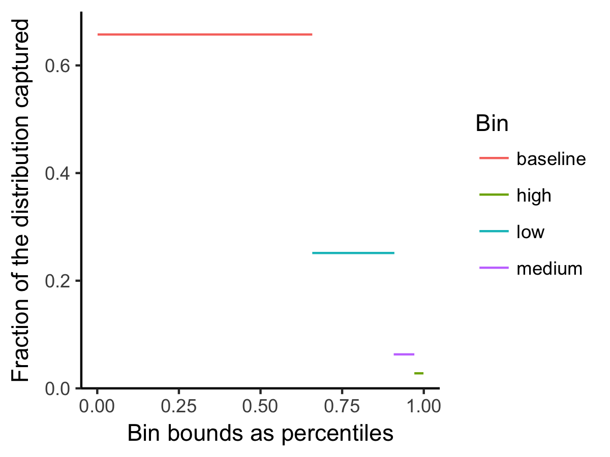
This shows the sizes of the bins in terms of the fractions of the overall distribution covered by each bin. In terms of expression space, we need to convert these to Z scores with the reverse normal CDF function `qnorm`
```R
#convert bin fractions to Z scores
binStats$binStartZ = qnorm(binStats$binStartQ)
binStats$binEndZ = qnorm(binStats$binEndQ)
```
Now let's plot the bins as the Z score bounds of a normal distribution, with an actual normal distribution overlaid in gray.
```R
p = ggplot(binStats, aes(colour=Bin))  + geom_density(data=data.frame(x=rnorm(100000)), aes(x=x), fill="gray", colour=NA)+ geom_segment(aes(x=binStartZ, xend=binEndZ, y=fraction, yend=fraction)) + xlab("Bin bounds as expression Z-scores") + ylab("Fraction of the distribution captured") +theme_classic()+scale_y_continuous(expand=c(0,0))+coord_cartesian(ylim=c(0,0.7)); print(p)
```
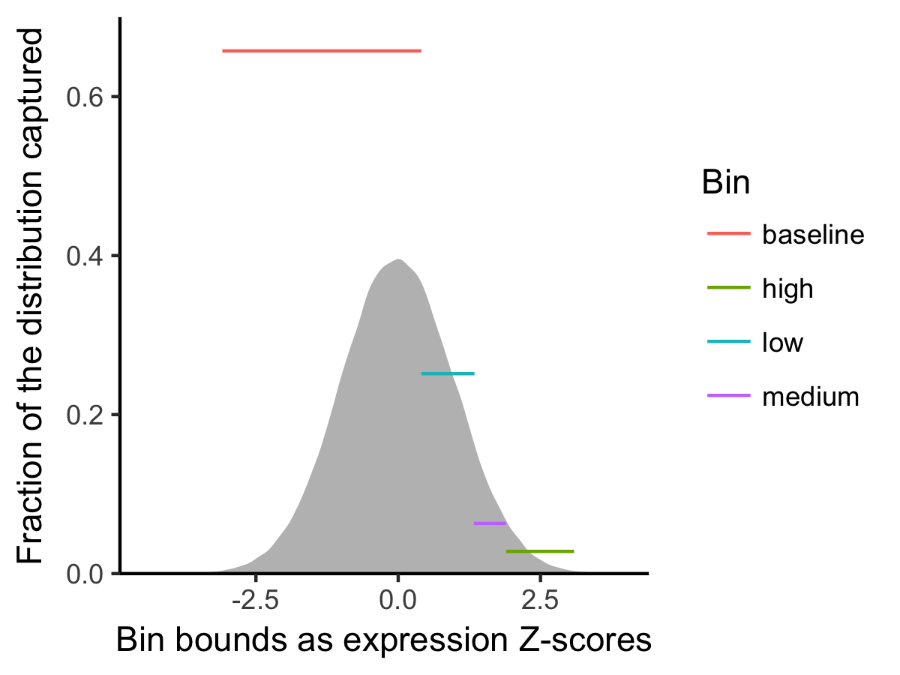

Here, we are forced to use the same distribution for both experimental replicates since we didn't have the underlying data. You should derive this data from the FACS sorting data separately for each replicate (although it doesn't affect things that much if the bins were drawn similarly).
```R
binStats = rbind(binStats, binStats) #duplicate data
binStats$expt = c(rep("1",4),rep("2",4)); #name the first duplicate expt "1" and the next expt "2";
```

## 1) MAUDE: Calculate guide level statistics
Now we've finally gotten to the part where we're running MAUDE.  To compute guide-level stats, we run `findGuideHitsAllScreens`
This step takes about a minute to run.
```R
guideLevelStats = findGuideHitsAllScreens(experiments = unique(binReadMat["expt"]), countDataFrame = binReadMat, binStats = binStats, sortBins = c("baseline","high","low","medium"), unsortedBin = "back", nonTargeting = "isNontargeting")
```
Here, we calculated the mean expression of each guide
```R
# Plot the guide-level mus
p = ggplot(guideLevelStats, aes(x=mean, colour=isNontargeting, linetype=expt)) + geom_density()+theme_classic()+scale_y_continuous(expand=c(0,0)) + geom_vline(xintercept = 0)+xlab("Learned mean guide expression"); print(p);
```
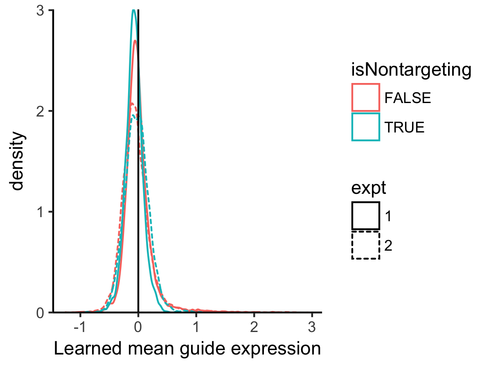
But notice how the distributions for the non-targeting guides are off-centre.  This is why we also calculate a re-centred Z-score using the non-targeting guides.

```R
# Plot the guide-level Zs
p = ggplot(guideLevelStats, aes(x=Z, colour=isNontargeting, linetype=expt)) + geom_density()+theme_classic()+scale_y_continuous(expand=c(0,0)) + geom_vline(xintercept = 0)+xlab("Learned guide expression Z score"); print(p)
```
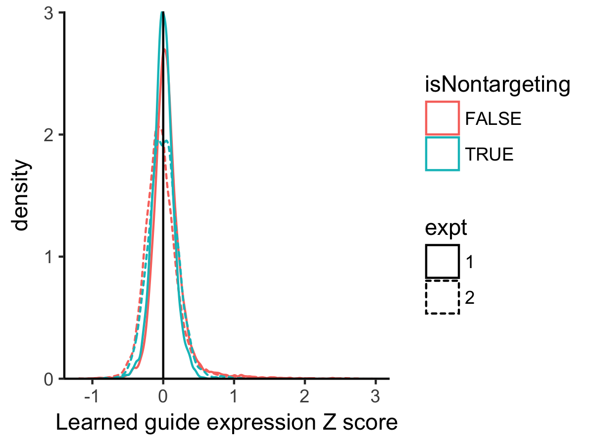
Now the non-targeting guides are centred at 0, as expected since they have no effect on expression.  

Now that we have guide-level statistics, we can inspect them. We can see there is a high correlation between replicates:
```R
guideEffectsByRep = cast(guideLevelStats, gRNA_systematic_name + isNontargeting +PAM_3primeEnd_coord ~ expt, value="Z")

p = ggplot(guideEffectsByRep[!guideEffectsByRep$isNontargeting,], aes(x=`1`, y=`2`)) + geom_point(size=0.3) + xlab("Replicate 1 Z score") + ylab("Replicate 2 Z score") + ggtitle(sprintf("r = %f",cor(guideEffectsByRep$`1`[!guideEffectsByRep$isNontargeting],guideEffectsByRep$`2`[!guideEffectsByRep$isNontargeting])))+theme_classic(); print(p)
```
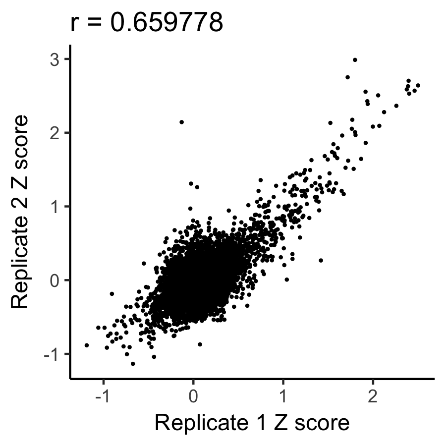
They are pretty highly correlated at the effect size.  Now let's map the results across the CD69 locus.

```R
dhsPos = min(guideLevelStats$Z)*1.05;
p=ggplot(guideLevelStats, aes(x=PAM_3primeEnd_coord, y=Z)) +geom_point(size=0.5)+facet_grid(expt ~.)+ geom_segment(data = dhsPeakBED, aes(x=st, xend=en,y=dhsPos, yend=dhsPos), colour="red") + theme_classic() + xlab("Genomic position") + ylab("Guide Z score"); print(p)
```
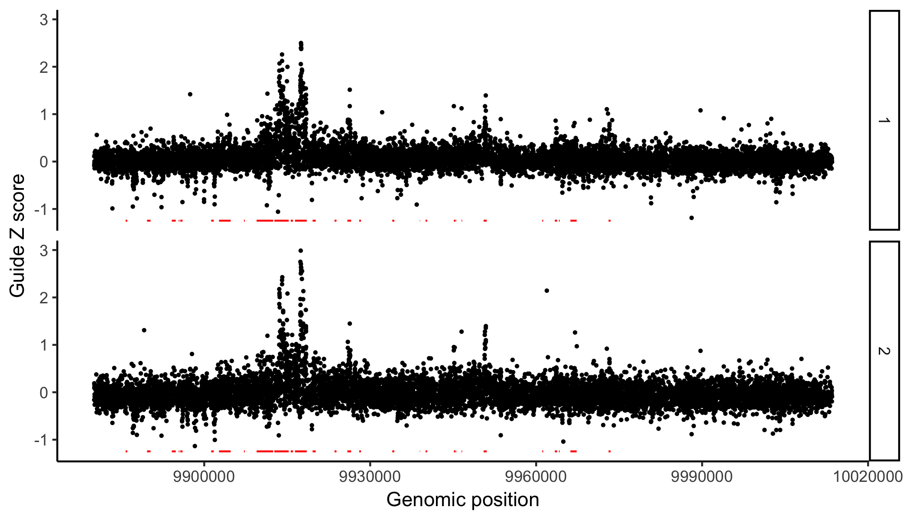
Here, the DHS peaks are shown in red. Clearly some regions contain many active guides, the majority of which have high Z-scores, indicating CD69 activation.

## 2) MAUDE: Identify active elements
There are two ways to get element-level statistics, depending on how the screen was done.  If you have regulatory element annotations, you can use `getElementwiseStats` to identify active elements.  If you did a tiling screen, you could use the same, but you can also identify active regions in an unbiased way with `getTilingElementwiseStats`.
### 2a) Get element level stats with sliding window
Now, we can combine adjacent guides in an unbiased way, using a sliding window across the locus to identify regions with more active guides than expected by chance. Here we use a sliding window of 200 bp, and the default minimum guide number (5). Any 200 bp with fewer than 5 guides will not be tested.

```R
guideLevelStats$chr = "chr12"; # we need to tell it what chromosome our guides are on - they're all on chr12
slidingWindowElements = getTilingElementwiseStats(experiments = unique(binReadMat["expt"]), normNBSummaries = guideLevelStats, tails="both", window = 200, location = "PAM_3primeEnd_coord",chr="chr",nonTargeting = "isNontargeting")
```

Now that we have element-level stats, let's inspect them! First, let's look at the whole locus.
```R
dhsPos = min(slidingWindowElements$meanZ)*1.05;
p=ggplot(slidingWindowElements, aes(x=start, xend=end, y=meanZ,yend=meanZ, colour=FDR<0.01)) +geom_segment(size=1)+facet_grid(expt ~.) + theme_classic() + xlab("Genomic position") + ylab("Element Z score") + geom_hline(yintercept = 0) + geom_segment(data = dhsPeakBED, aes(x=st, xend=en,y=dhsPos, yend=dhsPos), colour="black"); print(p)
```
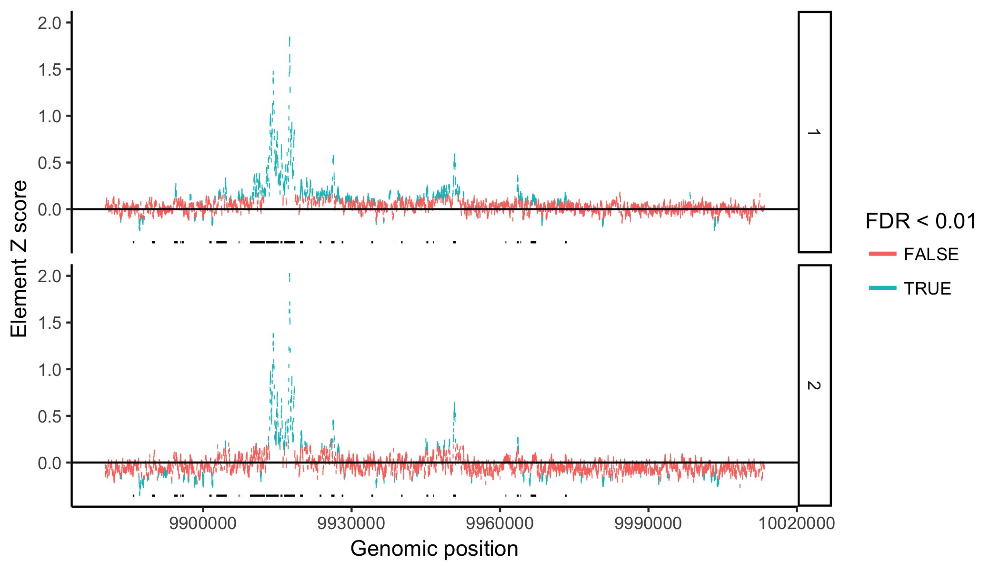
In the above, we see that there are some regions significantly upregulated or down-regulated, which are often shared between the two replicates. The regions that upregulate CD69 preferentially lie in open chromatin (DHS - black, in the above).

How correlated are the effect size estimates for the two replicates at the element level?
```R
slidingWindowElementsByRep = cast(slidingWindowElements, chr + start + end +numGuides ~ expt, value="meanZ")
p = ggplot(slidingWindowElementsByRep, aes(x=`1`, y=`2`)) + geom_point(size=0.5) + xlab("Replicate 1 element effect Z score") + ylab("Replicate 2 element effect Z score") + ggtitle(sprintf("r = %f",cor(slidingWindowElementsByRep$`1`,slidingWindowElementsByRep$`2`)))+theme_classic(); print(p)
```
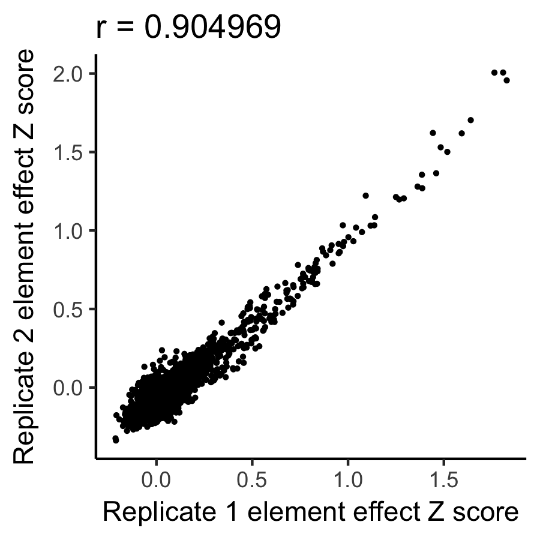
Quite highly correlated!

### 2b) Get element level stats with annotated elements
Since we have annotated elements anyway in `dhsPeakBED`, it might help us to identify which guides should be combined.  This would be the only way to do it if we had only targeted these regions to begin with.

```R
#the next command annotates our guides with any DHS peak they lie in.
annotatedGuides = findOverlappingElements(guides = unique(guideLevelStats[!guideLevelStats$isNontargeting, c("PAM_3primeEnd_coord","gRNA_systematic_name","chr")]), elements = dhsPeakBED, elements.start = "st", elements.end = "en", elements.chr = "chr", guides.pos = "PAM_3primeEnd_coord", guides.chr = "chr")

#merge regulatory element annotations back onto guideLevelStats
guideLevelStats = merge(guideLevelStats, annotatedGuides[c("gRNA_systematic_name", "name")], by="gRNA_systematic_name", all.x=T)

#this is where we are actually running MAUDE to find element-level stats
dhsPeakStats = getElementwiseStats(experiments = unique(binReadMat["expt"]), normNBSummaries = guideLevelStats, nonTargeting = "isNontargeting", elementIDs = "name") # "name" is the peak IDs from the DHS BED file

#merge peak info back into dhsPeakStats
dhsPeakStats = merge(dhsPeakStats, dhsPeakBED, by="name");
```

Now we can again look at the activity of the elements across the locus:
```R
p=ggplot(dhsPeakStats, aes(x=st, xend=en, y=meanZ,yend=meanZ, colour=FDR<0.01)) +geom_segment(size=1)+facet_grid(expt ~.) + theme_classic() + xlab("Genomic position") + ylab("Element Z score") + geom_hline(yintercept = 0); print(p)
```
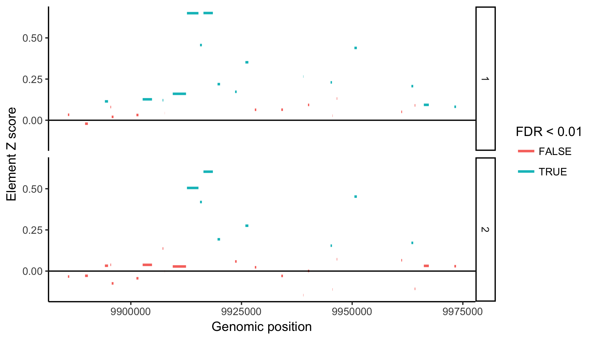

And the correlation between replicates.
```R
dhsPeakStatsByRep = cast(dhsPeakStats, name ~ expt, value="meanZ")

p = ggplot(dhsPeakStatsByRep, aes(x=`1`, y=`2`)) + geom_point() + xlab("Replicate 1 DHS effect Z score") + ylab("Replicate 2 DHS effect Z score") + ggtitle(sprintf("r = %f",cor(dhsPeakStatsByRep$`1`,dhsPeakStatsByRep$`2`)))+theme_classic(); print(p)
```
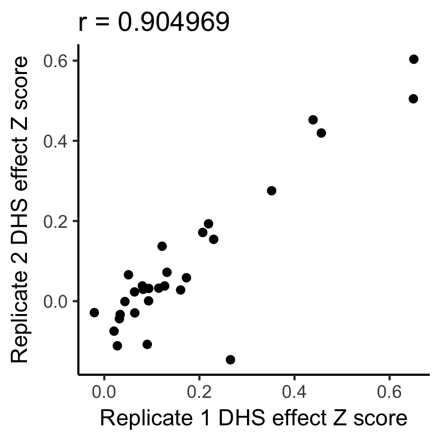
Again, these are highly correlated.
In this case, it didn't look like the regulatory element annotations helped our analysis, but that is not always true. 

Let's see investicate why this might be by looking at the guide effect sizes for the guides within each DHS element.
```R
p=ggplot(guideLevelStats, aes(x=Z, group=name, colour=name == "chr12:9912678-9915275")) + stat_ecdf(alpha=0.3)+ 
  stat_ecdf(data=guideLevelStats[!is.na(guideLevelStats$name) & guideLevelStats$name=="chr12:9912678-9915275",], size=1)+
  facet_grid(expt ~.) + theme_classic() + xlab("Guide Z score")+scale_y_continuous(expand=c(0,0)) + 
  scale_x_continuous(expand=c(0,0)) + scale_colour_manual(values=c("black","red")) + labs(colour = "CD69 promoter?")+ylab("Cumulative fraction"); print(p)
```
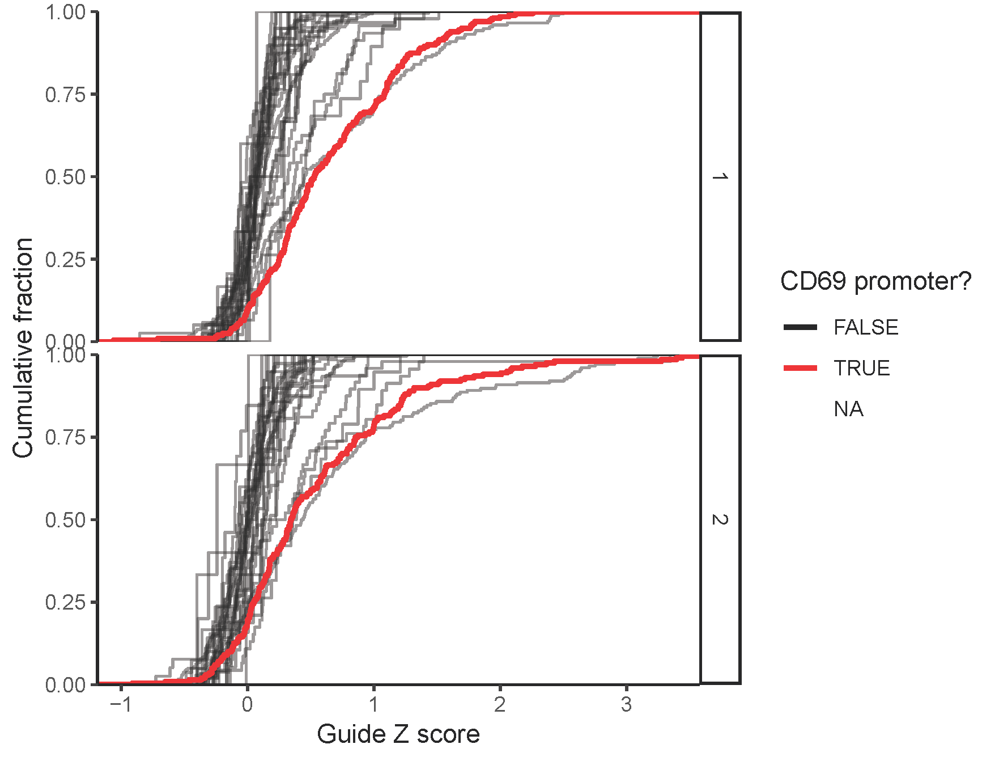
Here, the promoter DHS peak is in red and all the other DHS peaks are in black. You can appreciate that the promoter tends to have among the most influencial guides (rightward shift in the CDF curves). Even for the promoter, there is substantial variability in the estimated guide effect sizes, ranging from not doing anything (near 0) to pretty sizable effects (>3).  This is probably a combination of factors, including experimental noise, how effective each guide targets the region, and the effect of actually targeting each region.


